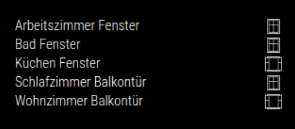
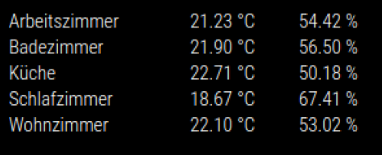

# MMM-openhabQuickWatch
This module retrieves and displays the device status from openhab.

## Screenshot



 
## Installation

In your terminal, go to your MagicMirror's Module folder:
````
cd ~/MagicMirror/modules
````

Clone this repository:
````
git clone https://github.com/steve415/MMM-openhabQuickWatch.git
````

Install dependencies:
````
npm install
````


Configure the module in your `config.js` file.

## Using the module

To use this module, add the following configuration block to the modules array in the `config/config.js` file:
```js
var config = {
    modules: [
        {
            module: 'MMM-openhabQuickWatch',
            position: "top_right", // All available positions
            config: {
                // See below for configurable options
                ohItems : ["Door1Contact", "gRoom1"]
            }
        }
    ]
}
```

## Configuration Options

| Option |  Description | 
|---|---|
| `openhabUrl` | The IP or Hostname of your openhab installation.<br><br>**Type:** `string`<br>**Default:** `'http://openhab:8080/'` | 
| `ohItems` | You define here the openhab items to display. See below the configuration. <br><br>**Type:** `Array`<br>**Default:** `[]` | 
| `updateInterval` | Time to refresh the items states in milliseconds. <br><br>**Type:** `Number`<br>**Default:** `10000` (10 seconds)| 


### Door or Window Item

Items can be either of type contact for windows or door. 

```java
Contact Door1Contact "Door 1 [MAP(de.map):%s]" (group) {channel="..."}
```

### Temperature Group

Or a group consisting of a temperature item and a humidity item.

```java
Group gRoom1 "Room1"
Number:Temperature   Room1Temperature    "Temperature"         (gRoom1)       {channel="..."}
Number:Dimensionless   Room1Humidity       "Humidity"           (gRoom1)        {channel="..."}
```

